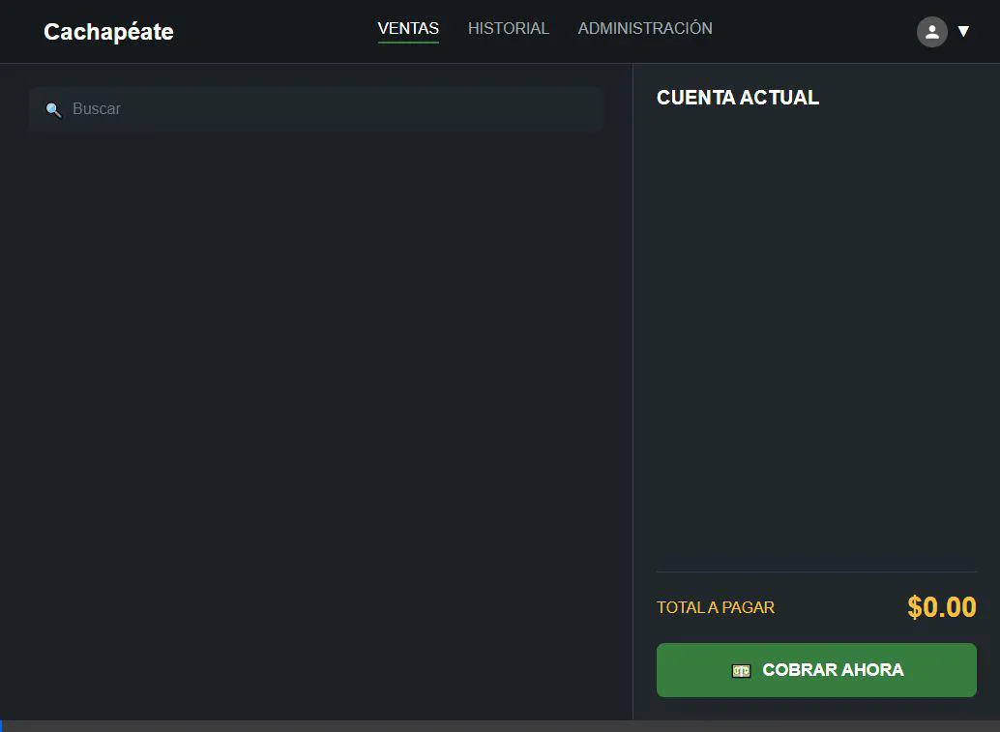

# POS PROFESIONAL - CACHAPEATE 🚀

Sistema de Punto de Venta (POS) optimizado para "Cachapeate - Las Cachapas de Aroa", diseñado para una gestión rápida, eficiente y profesional.



## 🌟 Características Principales

-   **Multi-moneda (USD/VES)**: Manejo dual de bolívares y dólares con tasa de cambio configurable en tiempo real.
-   **Facturación Profesional**: Generación de tickets con numeración secuencial (F-00000) y datos fiscales personalizables.
-   **Base de Datos de Clientes**: Registro integrado de Cédula/RIF, Dirección y Email con búsqueda inteligente.
-   **Facturación Digital (PDF & Email)**: Generación automática de facturas en PDF y envío automatizado por correo.
-   **Control de Inventario**: Grilla visual por categorías con gestión directa de productos y precios.
-   **Reportes y Cierres**: Consultas detalladas por fecha y reporte de cierre de caja optimizado.
-   **Multi-Plataforma**: Soporte para impresión directa tanto en Windows como en Linux (CUPS/lp).

## 🛠️ Instalación y Uso (Versión Web)

1.  **Instalar Dependencias**:
    Abre tu terminal en esta carpeta y ejecuta:
    ```bash
    pip install -r requirements.txt
    ```
2.  **Iniciar Servidor Web**:
    Ejecuta el servidor Flask con el siguiente comando:
    ```bash
    python app.py
    ```
3.  **Acceso a la Aplicación**:
    Ingresa desde cualquier navegador web en el mismo equipo a:
    `http://127.0.0.1:5000`

## 📸 Gestión de Imágenes de Productos

La plataforma permite conectar visualmente cada producto con una fotografía de forma automática:

- **Subida Directa**: Desde el panel de **ADMINISTRACIÓN**, utiliza el botón de **Seleccionar Archivo** al crear o editar un producto.
- **Automatización**: El sistema guarda la imagen en `static/images/products/` y la vincula al producto sin necesidad de renombrado manual.
- **Visualización Inmediata**: Las imágenes aparecerán en la grilla principal de ventas al instante.

## ⚙️ Administración Web
Desde la pestaña **ADMINISTRACIÓN** dentro de la web puedes:
- Realizar el cierre de caja (con protección de sobreescritura).
- Actualizar la tasa del dólar en tiempo real.
- **Gestionar Inventario**: Añadir, editar o **eliminar** productos con sugerencias inteligentes.
- **Eliminar Ventas**: Posibilidad de anular tickets del día (solo antes del cierre).
- **Configurar Email**: Acceso directo para configurar tus credenciales SMTP.

## 📧 Configuración de Correo Electrónico

Para habilitar el envío automático de facturas:
1.  Haz clic en **"Configurar Email"** en el panel lateral.
2.  Ingresa los datos de tu servidor SMTP (Gmail, Outlook, etc.).
3.  **Gmail Note**: Usa una **"Contraseña de Aplicación"** de 16 caracteres (generada en tu cuenta de Google) en lugar de tu contraseña normal.
4.  Usa el botón **"PROBAR ENVÍO"** para verificar la conexión antes de cobrar.

## 📊 Estructura de Datos
-   `data/ventas.csv`: Registro histórico detallado (incluye IDs únicos para migración SQL).
-   `data/clientes.csv`: Base de datos persistente de clientes.
-   `data/facturas_pdf/`: Repositorio de facturas digitales generadas.
-   `config/settings.json`: Configuración de datos fiscales, logo y tasa.

---
Para más detalles técnicos sobre la arquitectura y el futuro del proyecto, consulta: [PROJECT_STATUS.md](PROJECT_STATUS.md)

© 2026 - Desarrollado para Cachapeate. Listo para producción.
